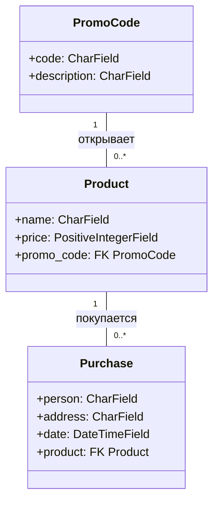

# Лабораторная работа 2 по дисциплине «Технологии программирования»

Учебный проект: интернет-магазин на Django (модель MVC). Основа —
кафедральный проект [kpdvstu/PTLab2](https://github.com/kpdvstu/PTLab2),
доработан по индивидуальному заданию (вариант 6).

Часть по CI/CD и развёртыванию на Heroku по согласованию **не выполнялась**
(файлы `.travis.yml` и `Procfile` удалены из проекта).

## Постановка задачи

1. Изучить модель MVC и фреймворк Django на примере учебного проекта
   «магазин».
2. Развернуть проект локально: база данных, миграции, фикстуры, модульные
   тесты, запуск веб-сервера.
3. Индивидуальное задание, вариант 6 — «Магазин компьютеров»: покупатель
   может указать промокод, при введении которого ему показываются
   дополнительные товары. У магазина несколько различных промокодов, каждый
   из которых влияет на доступность определённых товаров.
4. Покрыть новую функциональность модульными тестами, вести разработку в
   отдельной ветке с последующим слиянием в главную.

## Краткое описание проекта (MVC)

- **Model** — `shop/models.py`: `Product`, `Purchase`, а также добавленные
  `PromoCode` и связь `Product.promo_code` (товар с промокодом скрыт из
  каталога, пока код не активирован).
- **View (представление)** — `shop/views.py`: `index` (каталог + активация
  промокода через POST-форму, активные коды хранятся в сессии) и
  `PurchaseCreate` (оформление покупки; попытка купить закрытый товар без
  промокода возвращает 404).
- **Controller** — Django URL-dispatcher (`shop/urls.py`, `tplab2/urls.py`):
  маршрутизация запросов представлениям.
- **Шаблоны** — `shop/templates/shop/`: `index.html` (список товаров, форма
  ввода промокода, активные коды), `purchase_form.html`.

Промокоды в базе (фикстура `products.yaml`): `GAMER` — игровое кресло и
руль, `STUDENT` — учебный нетбук, `NEWYEAR` — подсветка монитора.
Регистронезависимо; повторная активация не ошибка; чужой/пустой код —
сообщение об ошибке.

## Как запустить

```bash
pip install -r requirements.txt
set USE_SQLITE=1            # в PowerShell: $env:USE_SQLITE="1"
python manage.py migrate
python manage.py loaddata products.yaml
python manage.py test shop/tests/
python manage.py runserver
```

Открыть http://127.0.0.1:8000, ввести промокод `GAMER` — в каталоге
появятся дополнительные товары.

Для PostgreSQL (по методичке): создать базу `django_db`, задать пароль в
`DATABASE_PASSWORD` и убрать `USE_SQLITE` из окружения.

## Используемые языки / библиотеки / технологии

- Python 3, Django (MTV-реализация MVC), шаблоны Django;
- PostgreSQL (по методичке) / SQLite (для разработки без СУБД);
- фикстуры Django (YAML), модульные тесты `django.test`;
- Git, GitHub (без Travis CI / Heroku — по согласованию).

## UML-диаграмма классов итоговой модели



## Теоретические вопросы

1. **MVC** — архетип разделения кода: Модель отвечает за данные и бизнес-
   логику, Представление — за отображение, Контроллер — за обработку ввода и
   выбор обработки. Жизненный цикл: запрос → контроллер (URL-роутер) →
   обращение модели к данным → рендер представления → ответ клиенту.
2. **MVC-фреймворки** — Django (MTV), Flask + расширения, Spring MVC,
   ASP.NET MVC, Ruby on Rails, Laravel и др.; все реализуют разделение
   ответственности и переиспользование компонентов.
3. **Автоматическое развёртывание в CI/CD** — конвейер, в котором после
   коммита автоматически собирают приложение, прогоняют тесты и публикуют
   его на хостинге (в данной работе эта часть не выполнялась).

## Выводы

Изучена архитектура MVC на примере Django-приложения: настроено окружение,
выполнены миграции и загрузка фикстур, приложение запущено локально и
покрыто тестами. По индивидуальному заданию (вариант 6) реализован механизм
промокодов: модель `PromoCode`, скрытие/отображение дополнительных товаров
в каталоге, запрет покупки закрытого товара, хранение активных кодов в
сессии. Добавлено 20 новых модульных тестов (всего 25, все проходят).
Разработка велась в ветке `feature/promocodes-variant6`, затем ветка
слита в главную (`master`) через `--no-ff` merge.
