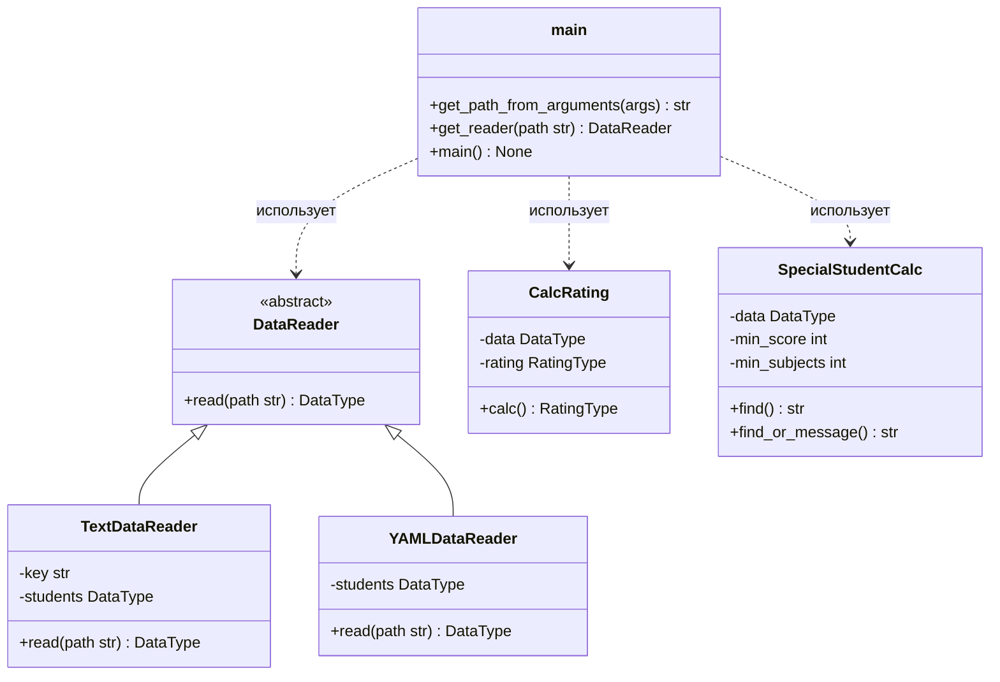

# Лабораторная работа 1 по дисциплине «Технологии программирования»

## Постановка задачи

Освоить базовые командные строки системы контроля версий Git и её сервера
GitHub; ознакомиться с принципами непрерывной интеграции (CI) и
непрерывного развёртывания (CD); создать проект расчёта рейтинга студентов,
настроить GitHub Actions для автоматического запуска линтера и модульных
тестов; выполнить индивидуальное задание (вариант 6).

## Краткое описание проекта

Программа считает средний рейтинг студента по оценкам за дисциплины.
Данные читаются из входного файла через класс-наследник абстрактного
`DataReader`. В проекте реализованы два формата: текстовый (`.txt`) и
YAML (`.yaml`, индивидуальное задание). Консольная часть (`main.py`)
определяет формат по расширению файла, печатает прочитанные данные,
рейтинги и результат индивидуального задания.

Пример запуска:

```
python src/main.py -p data/data.yaml
```

Структура проекта:

```
rating
├── .github/workflows/github-actions-testing.yml
├── data/
│   ├── data.txt
│   └── data.yaml
├── src/
│   ├── CalcRating.py
│   ├── DataReader.py
│   ├── TextDataReader.py
│   ├── Types.py
│   ├── YAMLDataReader.py
│   ├── SpecialStudentCalc.py
│   └── main.py
├── test/
│   ├── test_CalcRating.py
│   ├── test_TextDataReader.py
│   ├── test_YAMLDataReader.py
│   ├── test_SpecialStudentCalc.py
│   └── test_main.py
├── LICENSE
├── README.md
└── requirements.txt
```

## Индивидуальное задание, вариант 6

1. Добавлен класс `YAMLDataReader` — наследник `DataReader`, читающий входной
   файл в формате YAML (библиотека `pyyaml`) и возвращающий структуру
   `DataType`. Покрыт модульными тестами (обычный файл, пустой файл, студент
   без дисциплин, оценки в виде строк).
2. Добавлен класс `SpecialStudentCalc`, который определяет и выводит на
   экран студента, имеющего 76 баллов минимум по трём дисциплинам. Если таких
   студентов несколько — выводится любой из них; если таких студентов нет —
   выводится сообщение об их отсутствии. Покрыт модульными тестами, включая
   граничные значения (оценка ровно 76, две подходящие оценки вместо трёх).
3. В проекте выбрана лицензия MIT (`LICENSE`), добавлен `.gitignore`.
4. Разработка велась в отдельных ветках; CI (GitHub Actions) запускает
   `pycodestyle` и `pytest` при каждом пуше в `main`.

## Используемые языки / библиотеки / технологии

- Python 3.10, PEP 8;
- pytest — модульное тестирование;
- pycodestyle — проверка стиля;
- pyyaml — разбор YAML;
- Git, GitHub, GitHub Actions (CI/CD).

## UML-диаграмма классов



## Ответы на теоретические вопросы

1. **Системы управления версиями** — инструменты хранения истории изменений
   файлов и согласования совместной работы. Локальные (RCS) хранят историю в
   локальном репозитории; централизованные (SVN) — на сервере, с которого все
   подтягивают изменения; распределённые (Git) — полная копия истории есть у
   каждого участника, что позволяет работать офлайн и не зависеть от сервера.
2. **Создание и клонирование репозитория** — `git init` создаёт репозиторий в
   текущей папке, `git clone <url>` копирует существующий репозиторий вместе
   с историей и рабочей копией.
3. **Фиксация изменений** — файлы находятся в состоянии неизменённого,
   модифицированного или индексированного; `git add` индексирует изменения,
   `git commit` сохраняет индексированное в виде коммита, `git status`
   показывает текущее состояние.
4. **Лицензии** — Git поддерживает распространённые лицензии (MIT, Apache-2.0,
   GPL и т. п.); копилефт-лицензии (GPL) требуют сохранения тех же прав у
   производных работ, разрешающие (MIT, Apache) позволяют почти свободное
   использование.
5. **CI/CD** — непрерывная интеграция автоматически собирает и тестирует code
   при каждом изменении; непрерывное развертывание автоматически доставляет
   прошедшие проверку сборки в среду использования. Это снижает риск дефектов
   и ускоряет обратную связь.
6. **GitHub Actions** — платформа автоматизации на GitHub: workflow-файлы в
   `.github/workflows` описывают триггеры и задачи (jobs), которые выполняются
   на виртуальных машинах GitHub; здесь CI-пайплайн запускает линтер
   pycodestyle и тесты pytest при пуше в main.

## Выводы

В ходе работы освоены команды Git, создан и публично размещён репозиторий
проекта, настроен CI/CD-конвейер на GitHub Actions, автоматически проверяющий
код и тесты при каждом пуше. Выполнено индивидуальное задание варианта 6:
реализованы читатель YAML-файлов и класс расчёта студента с 76+ баллами
минимум по трём дисциплинам, добавлены модульные тесты, лицензия и
`.gitignore`. Все проверки CI проходят успешно.
